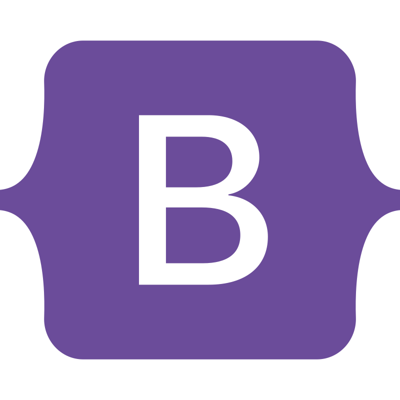

# Hi, I'm Yousef Magar 👋

### Front-End Developer & Aspiring Data Analyst  
Crafting engaging user experiences and unlocking insights through data.

---

## About Me

I'm Yousef Magar, a passionate front-end developer who loves turning ideas into beautiful, functional web applications. I specialize in building responsive, interactive interfaces using modern technologies like React and Tailwind CSS. Alongside development, I have a growing passion for data analysis — exploring data to uncover trends and support smart decisions.

I believe in blending creativity with logic, writing clean code, and continuously learning new skills. Whether it’s animating a UI or analyzing a dataset, I bring enthusiasm and precision to every project.

> _"They call us dreamers, but we're the ones who don’t sleep."_ 🌙

---

## 🧰 Tech Stack & Skills

- **Languages & Frameworks:**  
  HTML5 | CSS3 | JavaScript (ES6+) | React.js | Tailwind CSS | Bootstrap | SCSS

- **Tools & Libraries:**  
  Framer Motion | Git & GitHub | Visual Studio Code

- **Data Analysis:**  
  Python (Pandas, NumPy, Matplotlib) | Excel & Google Sheets | Data Cleaning & Visualization | Currently learning SQL & Power BI

- **Core Strengths:**  
  Front-End Development | Responsive Design | UI Animations & Interactivity | Exploratory Data Analysis | Version Control

---

## 📫 Contact Me

- 📧 Email: eng.usf.9.1@gmail.com  
- 📞 Phone: +20 10 155 200 12  
- 🔗 LinkedIn: [Let's Connect](https://linkedin.com/in/yourprofile)

---

## 🧰 Tech Toolbox

&nbsp;&nbsp;&nbsp;
&nbsp;&nbsp;&nbsp;
&nbsp;&nbsp;&nbsp;
&nbsp;&nbsp;&nbsp;
&nbsp;&nbsp;&nbsp;
&nbsp;&nbsp;&nbsp;
&nbsp;&nbsp;&nbsp;
&nbsp;&nbsp;&nbsp;
&nbsp;&nbsp;&nbsp;
&nbsp;&nbsp;&nbsp;
&nbsp;&nbsp;&nbsp;
&nbsp;&nbsp;&nbsp;
&nbsp;&nbsp;&nbsp;

---

#### Thanks for visiting my profile!  
💡 **Let’s build something amazing together!**

