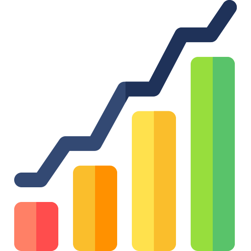

# Hi, I'm Yousef Magar 👋

### Full Stack .NET Developer & Aspiring Data Analyst

Building scalable web applications and exploring insights through data.

---

## About Me

I'm **Yousef Magar**, a passionate **Full Stack .NET Developer** who loves turning ideas into efficient, user-friendly web applications.
I specialize in building **dynamic front-ends with React & Tailwind CSS**, and **robust back-ends using ASP.NET Core and SQL Server**.

Alongside development, I’m growing my skills in **data analysis** — exploring data, finding patterns, and supporting smarter decision-making.

I believe in **writing clean, maintainable code**, blending creativity with problem-solving, and continuously learning new technologies.

> *"They call us dreamers, but we're the ones who don’t sleep."* 🌙

---

## 🧰 Tech Stack & Skills

* **Languages & Frameworks:**
  HTML5 | CSS3 | JavaScript (ES6+) | React.js | Tailwind CSS | C# | ASP.NET Core | Entity Framework | LINQ

* **Tools & Libraries:**
  Visual Studio | VS Code | Git & GitHub | Framer Motion | Postman | REST APIs | JSON

* **Databases & Data Analysis:**
  SQL Server | Python (Pandas, NumPy, Matplotlib) | Excel | Power BI (Learning) | Data Cleaning & Visualization

* **Core Strengths:**
  Full Stack Development | API Design | Database Management | Responsive UI | Data Analysis | Version Control | Problem Solving

---

## 📫 Contact Me

* 📧 Email: [eng.usf.9.1@gmail.com](mailto:eng.usf.9.1@gmail.com)
* 📞 Phone: +20 10 311 030 58
* 🔗 LinkedIn: [linkedin.com/in/yourprofile](https://linkedin.com/in/yourprofile)
* 🌐 Portfolio: [yousef-magar.vercel.app](https://yousef-magar.vercel.app)

---

## 🧰 Tech Toolbox

 &nbsp;&nbsp;&nbsp; &nbsp;&nbsp;&nbsp; &nbsp;&nbsp;&nbsp; &nbsp;&nbsp;&nbsp; &nbsp;&nbsp;&nbsp; &nbsp;&nbsp;&nbsp; &nbsp;&nbsp;&nbsp; &nbsp;&nbsp;&nbsp; &nbsp;&nbsp;&nbsp; &nbsp;&nbsp;&nbsp; &nbsp;&nbsp;&nbsp; &nbsp;&nbsp;&nbsp; &nbsp;&nbsp;&nbsp; &nbsp;&nbsp;&nbsp;  

---

### 🚀 Thanks for stopping by!

💡 **Let’s build something amazing together.**

